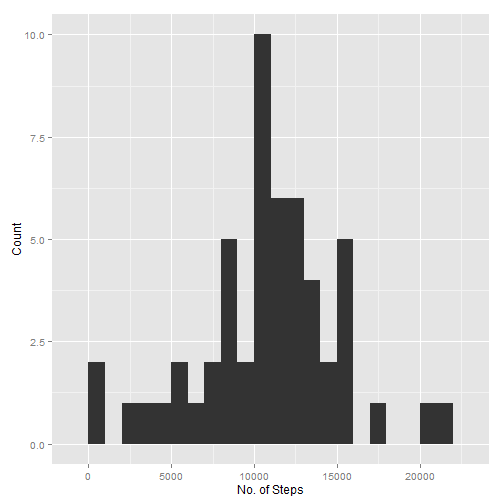
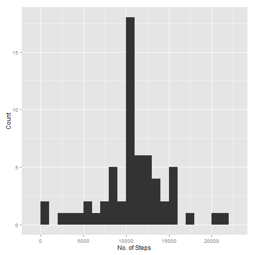

# Reproducible Research: Peer Assessment 1

---
author: "B. Spangehl"
date: "Saturday, July 19, 2014"
output: html_document
---


### Loading and preprocessing the data

```r
fileUrl <- "https://d396qusza40orc.cloudfront.net/repdata%2Fdata%2Factivity.zip"
fileZip <- "./activity.zip"

if (file.exists(fileZip) == F) {
  download.file(fileUrl, fileZip, mode = "wb")
  dateDownLoaded <- date()
}

DF <- read.csv(unz(fileZip,"activity.csv")                
               ,colClasses=c("integer","Date","integer"),na.strings="NA")
```


### What is mean total number of steps taken per day?

```r
steps.date <- aggregate(steps ~ date, data = DF, sum)
```

1. Make a histogram of the total number of steps taken each day

```r
ggplot(steps.date, aes(x=steps)) + xlab("No. of Steps") + ylab("Count") + 
      geom_histogram(binwidth = 1000)
```

 

2. Calculate and report the **mean** and **median** total number of steps taken per day  
Mean of total number of steps taken per day: 
10766.188679.  
Median of total number of steps taken per day: 
10765.


### What is the average daily activity pattern?
1. Make a time series plot (i.e. type = "l") of the 5-minute interval (x-axis) and the average number of steps taken, averaged across all days (y-axis)


```r
steps.interval <- aggregate(steps ~ interval, data = DF, mean)
plot(steps.interval, type = "l", xlab("Interval"), ylab("Steps"))
```

 

2. Which 5-minute interval, on average across all the days in the dataset, contains the maximum number of steps?

```r
steps.interval$interval[which.max(steps.interval$steps)]
```

```
## [1] 835
```

### Imputing missing values

1. Calculate and report the total number of missing values in the dataset (i.e. the total number of rows with NAs)

```r
sum(is.na(DF))
```

```
## [1] 2304
```

2. Devise a strategy for filling in all of the missing values in the dataset. The strategy does not need to be sophisticated. For example, you could use the mean/median for that day, or the mean for that 5-minute interval, etc.

Strategy is to use the means of the 5-minute intervals to replace the missing values.  

3. Create a new dataset that is equal to the original dataset but with the missing data filled in.


```r
newDF <- merge(DF,steps.interval, by="interval", suffixes=c("",".y"))
newDF$steps[is.na(newDF$steps)] <- newDF$steps.y[is.na(newDF$steps)]
```
4. Make a histogram of the total number of steps taken each day and Calculate and report the **mean** and **median** total number of steps taken per day. Do these values differ from the estimates from the first part of the assignment? What is the impact of imputing missing data on the estimates of the total daily number of steps?


```r
newSteps.date <- aggregate(steps ~ date, data = newDF, sum)
ggplot(newSteps.date, aes(x=steps)) + xlab("No. of Steps") + ylab("Count") + 
      geom_histogram(binwidth = 1000)
```

 

Mean of total number of steps taken per day: 
10766.188679.  
Median of total number of steps taken per day: 
10766.188679.

The mean before and after imputing remains the same. The median before and after imputing has changed slightly.
The imputing of missing data seems to have minimal effect on the estimates of the total daily number of steps.

### Are there differences in activity patterns between weekdays and weekends?
Create a new factor variable in the dataset with two levels -- 'weekday' and 'weekend' indicating whether a given date is a weekday or weekend day.
